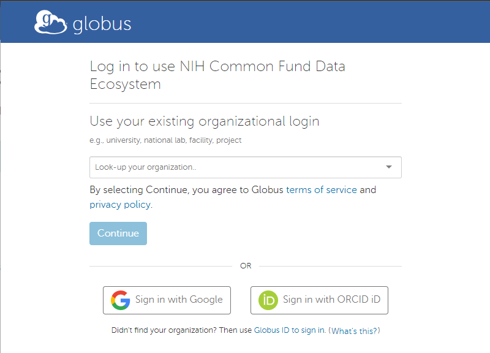
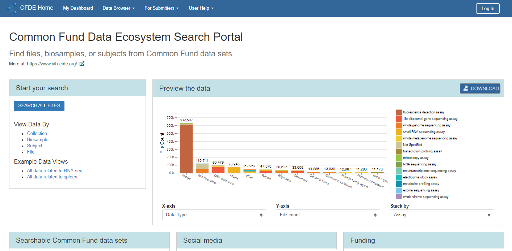
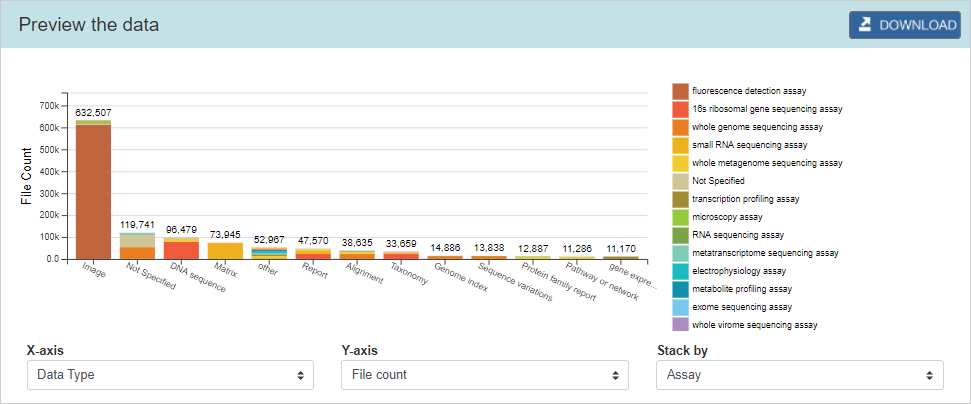

# Portal and Dashboard User Guide
## Version 2.0
**────────────────────────────────────**

**Revision History**

<table>
  <tr>
   <td><strong>Date (MM/DD/YYYY)</strong>
   </td>
   <td><strong>Version #</strong>
   </td>
   <td><strong>Changes Made By</strong>
   </td>
   <td><strong>Description of Change</strong>
   </td>
  </tr>
  <tr>
   <td>06/30/2020
   </td>
   <td>1.0
   </td>
   <td>Erin Friday
   </td>
   <td>Initial draft.
   </td>
  </tr>
  <tr>
   <td>11/05/2020
   </td>
   <td>2.0
   </td>
   <td>Erin Friday
   </td>
   <td>Updated for latest functionality.
   </td>
  </tr>
</table>

## Introduction

### Common Fund Data Ecosystem (CFDE)

The CFDE is an effort to identify and solve issues that inhibit data access and reuse across NIH Common Fund (CF) programs. The goal of the CFDE is for Common Fund data to be more usable and useful both within a single program and among data sets from multiple programs. By connecting the data sets and making them more accessible, the CFDE is intended to enable novel scientific research that was not possible before, including hypothesis generation, discovery, and validation.

The Common Fund programs include:

*   [4DN](https://www.4dnucleome.org/) – 4D Nucleome
*   [HMP](https://hmpdacc.org/) – Human Microbiome Project
*   [GTEx](https://gtexportal.org/home/) – Genotype-Tissue Expression
*   [KidsFirst](https://kidsfirstdrc.org/) – Gabriella Miller Kids First Pediatric Research Program
*   [LINCS](http://www.lincsproject.org/) – Library of Integrated Network-Based Cellular Signatures
*   [MoTrPAC](https://www.motrpac.org/) – Molecular Transducers of Physical Activity Consortium

The specific goals of the CFDE are to:

*   Increase usability – enable the uptake, reuse, and creation of Common Fund (CF) data and tools.
*   Preserve data – support the storage, sharing, and sustainability of CF data sets.
*   Provide training – maximize scientists’ ability to use CF data and other resources.

### Purpose of this Document

The CFDE website includes two modules to ensure the specific goals are met and users can find data—the [portal](https://app.nih-cfde.org/) and the [dashboard](https://app.nih-cfde.org/dashboard.html). This document describes those modules in detail. The goals of both the portal and the dashboard are to establish FAIR data production by:

*   **F** – Providing rich metadata using an entity-relationship model to express relationships between diverse data elements.
*   **A** – Offering rich access control and access to metadata via standard HTTP web service interfaces.
*   **I** – Integrating with standardized terms defined by collaborators, consortium, and communities.
*   **R** – Supporting dynamic model evolution so the presented data accurately represents the current structure and state of knowledge within an investigation.

To support these principals, the dashboard and data browser within the portal emphasize well-defined metadata and data models, use controlled vocabularies and ontologies, allow others to reproduce experiments, etc.

### Login

Currently, all features are available without a login, but this may change in the future.

To log into the portal and dashboard:

1. Click **Log In** in the upper-right of the page. The Login page displays.

    

1.  Search for your organization using the drop-down, sign in with Google, or sign in with an ORCID iD. 
  
    1. If you do not see your organization in the drop-down, then click **Sign in with ORCID ID** to create a Globus account. A warning message displays.

    

    1. Click **Allow**.
    1. Enter your information and click **Login**.

### View Your Profile

Select your name in the upper-right after logging in, click the down arrow, and select **Profile**.

## Portal

The CFDE portal is a hub for searching the CFDE data across all programs. The main page of the portal (shown below) is meant for high-level decision-making, whereas the repository (or “data browser”) allows users such as clinical researchers, bioinformatics power users, and NIH program officers to search for CFDE data. 

From the portal, you can:

*   View and export a dashboard bar chart.
*   Explore the repository of Common Fund data.
*   Access the full dashboard with additional summary charts.
*   Read documentation about the C2M2 and FAIR Cookbook.
*   See the latest news regarding the CFDE.

### Access the Portal

Access the portal directly by using this link: [https://app.nih-cfde.org/](https://app.nih-cfde.org/).

### Filter the Chart

The portal chart is an interactive graphic that renders automatically when different criteria are selected from the X-axis, Y-axis, and Stack By drop-downs. For example, the chart below shows the number of files by assay for each CF program.

To filter the portal chart:

1. Select an **X-axis** value from the drop-down. Options include:
    - CF Program
    - Data Type
    - Assay
    - Species
    - Anatomy

    The horizontal axis of the bar chart updates automatically with the option selected.

2. Select a **Y-axis** value from the drop-down. Options include:
    *   File Count
    *   Data Volume
    *   Sample Count
    *   Subject Count

    The vertical axis of the bar chart updates automatically with the option selected.

3. Select a **Stack By** value from the drop-down. Options include:
    *   CF Program
    *   Data Type
    *   Assay
    *   Species
    *   Anatomy

    The bars are stacked/sorted automatically with the option selected and the color-coded key updates with the appropriate categories.

---

NOTE: The same X-axis option cannot be selected for the Stacked By option, so the corresponding option in the Stacked By drop-down will be disabled if it is already selected in the X-axis drop-down.

---

### Export the Chart

The Export icon (
) displays next to each chart to export the data as a PNG, SVG, or CSV file. The PNG and SVG exports are image files of the chart, whereas the CSV export is a spreadsheet of the data.

### Explore the Repository

The CFDE repository, referred to as the “data browser,” provides views of the data based on the underlying data model and annotations. Using the data browser, you can:

*   Search, explore, and browse collections of data
*   Navigate from one data record to the next by following their relationships
*   Explore and export data collections
*   Share data with other users and cite the data for use in publications

The portal includes multiple ways to access the repository so you can view the data differently. For example, you can select “Browse All Collections” to see the entire CFDE data collection or select “Browse by Biosample” to see the data automatically pre-filtered by biosample. The data that displays and the Refine Search options differ based on the option selected. 

The repository can be accessed in the following ways from the portal:

*   Select **Browse All Data > Collection** from the main menu bar. See the [Browse All Collections](#browse-all-collections) section below for 
more information.
*   Click the **Search All Collections** button under Explore our Repository. See the [Browse All Collections](#browse-all-collections) section below for more information.
*   Click a link under View Data By in the Explore our Repository section to display a pre-filtered repository by one of the following features (NOTE: These options also display under the Browse All Data drop-down in the main menu bar):
    *   Collection – See the [Browse All Collections](#browse-all-collections) section below for more information.
    *   Biosample – See the [Browse by Biosample](#browse-by-biosample) section below for more information.
    *   Subject – See the [Browse by Subject](#browse-by-subject) section below for more information.
    *   File – See the [Browse by File](#browse-by-file) section below for more information.

    NOTE: The options under Popular Data Views may vary, so they are not discussed in this guide.

*   Select **Browse All Data > Project** from the main menu bar. See the 
[Browse by Project](#browse-by-project) section below for more information.
*   Select **Browse All Data > Vocabulary** from the main menu bar and select an item from the list. See the 
[Browse by Vocabulary](#browse-by-vocabulary) section below for more information.
*   Select **Browse All Data > ID Namespace** from the main menu bar. See the 
[Browse by ID Namespace](#browse-by-id-namespace) section below for more information.

### Browse All Collections

To search by all collections:

1. Select one of the following options:
    - The **Browse All Data > Collection** option in the main menu bar.
    - The **Search All Collections** button under Explore our Repository.
    - The **Collection** link under View Data By in the Explore our Repository section.

The entire CFDE data collection displays in the data browser.

  

2. The data browser includes the following columns in the results table:
*   View – Click the icon next to the appropriate record to view more information about the record. See the 
[View Details](#view-details) section for more information.
*   ID Namespace – A grouping of collection IDs.
*   Local ID – The unique collection ID within the ID Namespace.
*   Name – A short user-friendly label for the collection.
*   Description – A user-friendly description of the collection.
*   Creation Time – The date and time the collection was created.
3. The results can be filtered using the Refine Search filter panel. See the [Refine Search Results](#refine-search-results) section for more information. The panel includes the following facets by which you can filter the results:
*   Data Type
*   File Format
*   Assay Type
*   Anatomy
*   Subject Taxonomy
*   Common Fund Program
*   Project
*   Subject Granularity
*   Subject Role
*   Collection Creation Time
*   File Creation Time
*   Biosample Creation Time
*   Part of Collection
*   Contained Subject
*   Contained Biosample
*   Contained File

### Browse by Biosample

To search by biosample:

1. Select one of the following options:
*   The **Browse All Data > Biosample** option in the main menu bar.
*   The **Biosample** link under View Data By in the Explore our Repository section on the main portal page.

The data browser displays the CFDE data and filters related to biosamples.

2. The data browser includes the following columns in the results table:
*   View – Click the icon next to the appropriate record to view more information about the record. See the 
[View Details](#view-details) section for more information.
*   ID Namespace – A grouping of biosample IDs.
*   Local ID – The unique biosample ID within the ID Namespace.
*   Project – The project attributed as the source of the biosample.
*   Anatomy – The anatomy from which the biosample is derived.
*   Creation Time – The date and time the biosample was created.
3. The results can be filtered using the Refine Search filter panel. See the 
[Refine Search Results](#refine_search_results) section for more information. The panel includes the following facets by which you can filter the results:
*   Assay Type
*   Anatomy
*   Subject Taxonomy
*   Common Fund Program
*   Project
*   Creation Time
*   Source Subject
*   Described by File
*   Part of Collection

### Browse by Subject

To search by subject:

1. Select one of the following options:
*   The **Browse All Data > Subject** option in the main menu bar.
*   The **Subject** link under View Data By in the Explore our Repository section on the main portal page.

    The data browser displays the CFDE data and filters related to subjects.

2. The data browser includes the following columns in the results table:
*   View – Click the icon next to the appropriate record to view more information about the record. See the 
[View Details](#view-details) section for more information.
*   ID Namespace – A grouping of subject IDs.
*   Local ID – The unique subject ID within the ID Namespace.
*   Project – The project attributed as the source of the subject.
*   Granularity – The specificity of the subject description, i.e., organism versus cell-line.
*   Taxonomy – The classification concept(s) that characterize the subject.
*   Creation Time – The date and time the subject record was created.
3. The results can be filtered using the Refine Search filter panel. See the 
[Refine Search Results](#refine-search-results) section for more information. The panel includes the following facets by which you can filter the results:
*   Taxonomy
*   Subject Granularity
*   Taxonomic Role
*   Common Fund Program
*   Project
*   Creation Time
*   Derived Biosample
*   Described by File
*   Part of Collection

### Browse by File

To search by file:

1. Select one of the following options:
*   The **Browse All Data > File** option in the main menu bar.
*   The **File** link under View Data By in the Explore our Repository section on the main portal page.

    The data browser displays the CFDE data and filters related to files.

2. The data browser includes the following columns in the results table:
*   View – Click the icon next to the appropriate record to view more information about the record. See the 
[View Details](#view-details) section for more information.
*   ID Namespace – A grouping of file IDs.
*   Local ID – The unique file ID within the ID Namespace.
*   Filename – The name of the file excluding prepended PATH information.
*   Project – The project attributed as the source of the file.
*   Size in Bytes – The size of the file in bytes.
*   File Format – The content format of the file.
*   Data Type – The type of data represented by the file.
*   Assay Type – The assay type represented by the file.
*   Creation Time – The date and time the file was created.
3. The results can be filtered using the Refine Search filter panel. See the [Refine Search Results](#refine-search-results) section for more information. The panel includes the following facets by which you can filter the results:
*   Data Type
*   File Format
*   Assay Type
*   Anatomy
*   Subject Taxonomy
*   Common Fund Program
*   Project
*   Subject Granularity
*   Subject Role
*   File Creation Time
*   Biosample Creation Time
*   Size in Bytes
*   Uncompressed Size in Bytes
*   Part of Collection
*   Described Biosample
*   Described Subject

### Browse by Project

To search by project:

1. Select **Browse All Data > Project** from the main menu bar. The data browser displays the CFDE data and filters related to projects.

2. The data browser includes the following columns in the results table:
*   View – Click the icon next to the appropriate record to view more information about the record. See the
[View Details](#view-details) section for more information.
*   ID Namespace – A grouping of project IDs.
*   Local ID – The unique project ID within the ID Namespace.
*   Name – A short user-friendly label for the ID Namespace.
*   Description – A user-friendly description of the ID Namespace.
*   Creation Time – The date and time the project was created.
3. The results can be filtered using the Refine Search filter panel. See the 
[Refine Search Results](#refine-search-results) section for more information. The panel includes the following facets by which you can filter the results:
*   Creation Time
*   Super-Project
*   Sub-Project
*   Subject Granularity
*   Subject Role
*   Subject Taxonomy
*   Anatomy
*   Assay Type
*   File Format
*   Data Type

### Browse by Vocabulary

To search by vocabulary:

1. Select **Browse All Data > Vocabulary** from the main menu bar. 
2. Select an item from the list:
*   Anatomy
*   Assay Type
*   Data Type
*   File Format
*   NCBI Taxonomy
*   Subject Granularity
*   Subject Role

    The data browser displays the CFDE data and filters related to the vocabulary term.

3. The columns vary based on the vocabulary term selected. 
4. The available filters in the Refine Search panel vary based on the vocabulary term selected. See the 
[Refine Search Results](#refine-search-results) section for more information on how to filter the results.

### Browse by ID Namespace

To search by ID namespace:

1. Select **Browse All Data > ID Namespace** from the main menu bar.

    The data browser displays the CFDE data and filters related to the ID namespace data contributors.

2. The data browser includes the following columns in the results table:
*   View – Click the icon next to the appropriate record to view more information about the record. See the 
[View Details](#view-details) section for more information.
*   ID – The unique ID within the ID Namespace.
*   Abbreviation – A short label for the ID Namespace.
*   Name – A short user-friendly label for the ID Namespace.
*   Description – A user-friendly description of the ID Namespace.
3. The results can be filtered using the Refine Search filter panel. See the 
[Refine Search Results](#refine-search-results) section for more information. The panel includes the following facets by which you can filter the results:
*   ID
*   Abbreviation
*   Name
*   Description
*   Biosample
*   Collection
*   File
*   Project
*   Subject

### View Details

Click the icon in the View column (
) next to the appropriate record in the results table to view more information about the record, such as the metadata and links to the data files for that record. The options available on the View Details page vary based on the record selected, but this section of the document will use the screenshot below as an example. 

The metadata displays in the summary section at the top of the page. In the example above, the metadata includes:

*   ID Namespace – The hyperlink will display a View Details page for the Genotype-Tissue Expression ID Namespace.
*   ID – The unique ID within the ID Namespace.
*   Persistent ID – An identifier that provides a single view of an individual across numerous devices (desktop, mobile, in-app, etc.) without duplication.
*   Defined by Project – The hyperlink will display the Genotype-Tissue Expression (GTEx) project in a separate data browser.
     *   Click **Table Mode** to display the project in a table with additional information.    
    *   Click **Explore** to open the project in a separate data browser.

*  Name – A short user-friendly label for the ID Namespace.
*  Description – A user-friendly description of the ID Namespace.
*  Creation Time – The date and time the project was created.

The Sections panel on the left displays links to the contents of the View Details page (similar to a Table of Contents) and the counts for each section. Click one of the links to jump to that section of the View Details page. You can also scroll down the page to view the sections instead of using these links. 

Click **Explore** in the gray section header to open the section in a separate data browser, where you can use the Refine Search filter panel to refine your search. 

Within each data file, you can click the **View** icon to view additional information about the record.

The buttons in the upper-right of the page include:

*   Show/Hide empty sections - Toggles the empty sections that display on this page.
*   Export – See the 
[Export Search Results](#explore-search-results) section for more information.

### Refine Search Results

To use the facets to refine your search results:

1. Click the down arrow next to the appropriate facet to display the related attributes by which you can filter the results. 

2. Within a facet, you can perform any of the following to filter the results:
*   Select the appropriate attribute checkbox(es).
*   Use the Search box to search for attributes only within that facet.
*   Click **Show More** to display additional information about the attributes.

3. The time-related facets (Collection Creation Time, File Creation Time, and Biosample Creation Time) and the Size in Bytes facet function differently. To filter on a time-related facet, perform one of the following:
*   Enter the **From** and **To** dates and times. Click the blue checkmark to filter the results in the main data browser.
*   Use the interactive histogram to find the appropriate time period. Click and drag anywhere in the graph to zoom into a smaller subset of data. The From and To dates update automatically as you use the histogram, but you must select the blue checkmark to filter the results in the main data browser.

### Sort and View Search Results

The data browser search results can be sorted and viewed using the following functions:

*   The results table can be sorted by column header using the arrow icon (
).
*   View a different amount of results on one page by selecting a different option for the **Displaying first number of records** drop-down. 

*   Use the **Search All Columns** search box at the top of the results table to search for records within the table.

*   View additional results by clicking the **Next** button at the bottom of the table.
*   Click the **X** next to the filter to remove the one filter from the search results.

*   Click **Clear All Filters** to remove all filters from the search results.

### Export Search Results

Search results can be exported from the main data browser and from the View Details page. To export the search results:

1. Click the **Export** button. 

 
2. Select **CSV** or **BAG**. The options that display will depend on which page you are on:
*   CSV – Opens a .csv file in Excel that includes the metadata displayed in the search results in tabular format. All of the search results display in the file; not just the first page of results. The columns of the CSV file include:
    *   RID - The internal Record ID, which could be considered the Primary Key.
    *   RCT - The timestamp representing the Record Creation Time.
    *   RMT - The timestamp representing the Record Modified Time.
    *   RCB - The Record Created By, which is the GlobusAuth identity string (GUID) representing the creator of the record.
    *   RMB - The Record Modified By, which is the GlobusAuth identity string (GUID) representing the user who last modified the record.
    *   Id_namespace - A C2M2 column that represents the unique DCC namespace identifier assigned by the CFDE to the DCC.
*   BAG – This option is only available for the View Details page. Downloads the data to a .bag file used for storing ROS message data. Use this option if you want to download large files or if a particular dataset includes many files.

### Documentation

To access additional CFDE resources, select **Technical Documentation** from the main menu bar. The following resources are available:

*   About the CFDE includes the Code of Conduct, Contributing information, License information, this Portal and Dashboard User Guide, and a link to the [CFDE website](https://www.nih-cfde.org/).
*   The [CFDE Crosscut Metadata Model (C2M2)](https://cfde-published-documentation.readthedocs-hosted.com/en/latest/spec-and-docs/C2M2-usage-guides-and-technical-documents/000-INTRODUCTION/) is a flexible standard for describing biomedical experimental data.
*   The [FAIR Cookbook](https://cfde-published-documentation.readthedocs-hosted.com/en/latest/the-fair-cookbook/content/intro/) provides introductory materials about various aspects of FAIRness, including practical guides that show how to enhance digital objects by adhering them to communicated-accepted standards.
*   The [glossary](https://cfde-published-documentation.readthedocs-hosted.com/en/latest/CFDE-glossary/) is a list of common CFDE terms with definitions.

## Dashboard

The CFDE dashboard displays multiple charts for users to view high-level data. The charts update automatically with the selections you make and the precise numbers can be viewed by hovering over the chart. The charts include:

*   Two bar charts that allow users to compare CFDE data by CF Program, Data Type, Assay, Species, or Anatomy using File Count, Data Volume, Sample Count, or Subject Count. The X-axis, Y-axis, and Stack are configurable by all users to customize the data summaries as needed. These bar charts display near each other so you can compare two different data summaries.
*   Pie chart of the number of subjects by anatomy for a single assay type across all Common Fund programs.
*   Pie chart of the number of samples by anatomy for a single Common Fund program.

### Access the Dashboard

To access the dashboard:

*   Access the dashboard directly using this link: \
[https://app.nih-cfde.org/dashboard.html](https://app.nih-cfde.org/dashboard.html)
*   Click **Dashboard** in the main menu bar from the portal.

### Filter the Bar Charts

The bar charts allow users to compare CFDE data by CF Program, Data Type, Assay, Species, or Anatomy using File Count, Data Volume, Sample Count, or Subject Count. The X-axis, Y-axis, and Stack are configurable by all users to customize the data summaries as needed. The title of the charts update automatically to reflect the options selected.

To filter the bar charts:

1. Select an **X-axis** value from the drop-down. Options include:
*   CF Program
*   Data Type
*   Assay
*   Species
*   Anatomy

    The horizontal axis of the bar chart updates automatically with the option selected.

2. Select a **Y-axis** value from the drop-down. Options include:
*   File Count
*   Data Volume
*   Sample Count
*   Subject Count

    The vertical axis of the bar chart updates automatically with the option selected.

3. Select a **Stack By** value from the drop-down. Options include:
*   CF Program
*   Data Type
*   Assay
*   Species
*   Anatomy

    The bars are stacked/sorted automatically with the option selected and the color-coded key updates with the appropriate categories.

---

NOTE: The same X-axis option cannot be selected for the Stacked By option, so the corresponding option in the Stacked By drop-down will be disabled if it is already selected in the X-axis drop-down.

---

### Filter the Anatomy by Assay Type across the Common Fund Chart

To filter the anatomy by assay type across the Common Fund chart:

1. Select the **Assay Type** from the drop-down. Options include:
*   16s ribosomal gene sequencing assay
*   Hi-C assay
*   RNA sequencing assay
*   Cytokine assay
*   Epigenetic modification assay
*   Fluorescence detection assay
*   Mass spectrometry assay
*   Metabolite profiling assay
*   Protein expression profiling assay
*   Transcription profiling assay
*   Whole genome sequencing assay
*   Whole metagenome sequencing assay

    The pie chart updates automatically and displays the number of subjects for each anatomy category (e.g., blood plasma, digestive system, immune system, etc.) across all Common Fund programs based on the assay type selected.

### Filter the Anatomy by Common Fund Program Chart

To filter the anatomy by Common Fund program chart:

1. Select the **CF Program** from the drop-down. Options include:
*   4DN
*   HMP
*   LINCS
*   Metabolomics

    The pie chart updates automatically and displays the number of samples for each anatomy category (e.g., blood plasma, digestive system, immune system, etc.) based on the Common Fund program selected.

### Review DCC Data

The Data Review page displays a personalized dashboard for you to verify the data currently available for your DCC. The DCC data that displays is based on the DCC associated with your login account.

NOTE: Currently, only the HMP data is available for this feature. The other DCCs are coming soon.

The Data Review section on the left displays the data totals and the data breakdown numbers. These totals show you how many data files exist for your DCC overall, how many subjects are represented, and how many biosamples are in the project.

The Data Snapshot displays a bar chart of assay types by anatomy categories. Hover over a bar to view the exact totals for each.

To get help with reports or the data, click the associated link at the bottom of the page. Your default email application will open an email to [support@cfde.atlassian.net](mailto:support@cfde.atlassian.net). 

### Export the Chart

The Export icon ()(or Download button on the Data Review page) displays next to each chart to export the data as a PNG, SVG, or CSV file. The PNG and SVG exports are image files of the chart, whereas the CSV export is a spreadsheet of the data.

