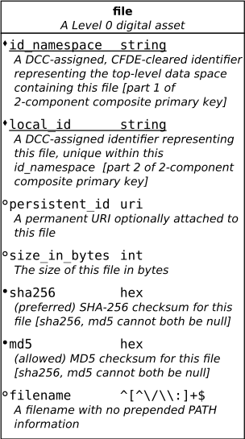

# C2M2 Level 0

C2M2 Level 0 defines a **minimal valid
[C2M2 instance](../../CFDE-glossary.md#c2m2-instance).**
Data submissions at this level of
[metadata richness](../../CFDE-glossary.md#c2m2-richness-levels)
will be the easiest to produce, and will support the simplest available
functionality implemented by downstream applications.

## Level 0 submission process: overview

Metadata submissions at Level 0 will consist of a single
[TSV file](../../CFDE-glossary.md#tsv)
describing a **collection of digital
[files](../../CFDE-glossary.md#file)**
owned or managed by a
[DCC](../../CFDE-glossary.md#dcc).
The properties listed for the Level 0 `file` entity (see below for
diagram and definitions) will serve as the TSV's column headers; each TSV
row will represent a single file. The Level 0 TSV itself thus represents a
**manifest or inventory** of digital files that a DCC wants to introduce
into the C2M2 metadata ecosystem.

This level encodes the most basic file metadata: its use by downstream applications will be
limited to informing the least specific level of data accounting, querying and reporting.

|_Level 0 model diagram_|
|:---:|
||

## Level 0 technical specification: properties of the `file` entity

**Required: `id_namespace` `local_id` `sha256|md5`**

|property|description|
|:---:|:---|
| `id_namespace` | String **identifier devised by the DCC managing this `file`** (cleared by CFDE-CC to avoid clashes with any preexisting `id_namespace` values). The value of this property will be used together with `local_id` as a **composite key structure formally identifying Level 0 `file` entities** within the total C2M2 data space. (See [C2M2 identifiers](#c2m2-identifiers) for discussion and examples.) |
| `local_id` | Unrestricted-format **string identifying this `file`**: can be any string as long as it **uniquely identifies each `file`** within the scope defined by the accompanying `id_namespace` value. (See [C2M2 identifiers](#c2m2-identifiers) for discussion and examples.) |
| `persistent_id` | **A permanent, resolvable URI permanently attached to this `file`**, meant to serve as a permanent address to which landing pages (which summarize metadata associated with this `file`) and other relevant annotations and functions can optionally be attached, including information enabling resolution to a network location from which the `file` can be downloaded. **Actual network locations must not be embedded directly within this identifier**: one level of indirection is required in order to protect `persistent_id` values from changes in network location over time as files are moved around. (See [C2M2 identifiers](#c2m2-identifiers) for discussion and examples.) |
| `size_in_bytes` | The **size of this `file` in bytes**. This varies (even for "copies" of the same `file`) across differences in storage hardware and operating system. CFDE does not require any particular method of byte computation: precise, reproducible file size integrity metadata will be provided in the form of checksum data in the `sha256` and/or `md5` properties. `size_in_bytes` will instead underpin automatic reporting of approximate storage statistics across different C2M2 collections of DCC metadata. |
| `sha256` | **CFDE-preferred** file checksum string: the output of the SHA-256 cryptographic hash function after being run on this `file`. One or both of `sha256` and `md5` is required. |
| `md5` | **Permitted** file checksum string: the output of the MD5 message-digest algorithm after being run as a cryptographic hash function on this `file`. One or both of `sha256` and `md5` is required. (CFDE recommends SHA-256 if feasible, but we recognize the nontrivial overhead involved in recomputing these hash values for large collections of files, so if MD5 values have already been generated, CFDE will accept them.) |
| `filename` | A filename with no prepended PATH information. |

## Level 0 technical specification: JSON Schema and example TSVs

A JSON Schema document (implementing
[Frictionless Data](https://frictionlessdata.io/)'s
"[Data Package](https://frictionlessdata.io/data-package/)"
container meta-specification) defining the Level 0 TSV can be found
[here](../C2M2-JSON-Schemas/C2M2_Level_0.datapackage.json);
an example Level-0-compliant TSV submission collection can be found
[here](../C2M2_example_submission_data/HMP__sample_C2M2_Level_0_bdbag.contents/file.tsv)
(just the `file.tsv` portion) and
[here](../C2M2_example_submission_data/HMP__sample_C2M2_Level_0_bdbag.tgz)
(as a packaged BDBag archive).

--------------------------------------------------------------------------------
